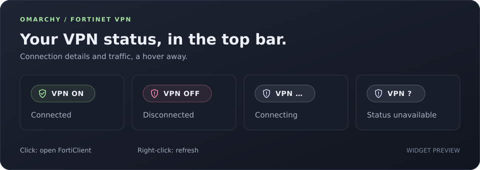

# Fortinet VPN for Omarchy

A compact, theme-aware shield badge for the Omarchy top bar. See whether FortiClient and its VPN tunnel are connected without opening the client.



*Illustrative preview. The widget uses your active Omarchy theme.*

## Features

- Checks FortiClient and its tunnel at a configurable interval (five seconds by default).
- Uses the active Omarchy palette, fonts and scaling, with automatic theme updates.
- Hover for the connection name, current tunnel IP, duration, transferred bytes, download/upload speed, and last check time.
- Optionally show the connection name and download/upload speed directly in the bar.
- Explains missing commands, timeouts, invalid configuration, and unavailable tunnels in the tooltip.
- Reads the current IPv4 or IPv6 address from the tunnel when FortiClient omits it.
- Left-click opens FortiClient; right/middle-click refreshes.
- Shows connected, disconnected, connecting and unavailable states.

## Requirements

**Install and configure the official FortiClient Linux client before installing this plugin.** Get the client from [Fortinet's official downloads page](https://www.fortinet.com/support/product-downloads), or use the official package provided by your organization's IT team. Configure your VPN connection in FortiClient, then verify that `forticlient vpn status` works as your desktop user.

This plugin monitors an existing FortiClient installation; it does not install the VPN client or configure a connection.

- Omarchy Quattro with the Quickshell plugin system and `omarchy plugin` commands.
- Official FortiClient Linux client: `forticlient vpn status` must work for your desktop user.
- FortiClient GUI at `/opt/forticlient/gui/FortiClient` for the click action.
- Rust and Cargo to build the status collector; iproute2 (`ip`) on PATH at runtime.

This plugin targets the official FortiClient client and its `fctvpn*` interfaces. OpenFortiVPN and OpenConnect are not currently supported. The status collector is a native Rust binary; Python is not required. Cargo downloads the dependencies during the first build.

## Install from GitHub

Download, build and enable the complete Omarchy widget with this command:

```bash
omarchy plugin add https://github.com/jadilson12/omarchy-fortinet-vpn.git && (
  cd "$HOME/.config/omarchy/plugins/jadilson12.fortinet-vpn" &&
  cargo build --release --locked --target-dir target &&
  omarchy plugin enable jadilson12.fortinet-vpn
)
```

For a local checkout, run the same build command in the project directory before enabling the plugin. The widget runs `target/release/fortinet-vpn-status` directly, so keep that binary in the plugin directory. Rebuild after updating the Rust source or `Cargo.lock`. A missing binary is shown as status unavailable.

Optionally place it beside the network icon:

```bash
omarchy bar move jadilson12.fortinet-vpn --section right --after omarchy.network
```

To install only the command-line collector from GitHub:

```bash
cargo install --git https://github.com/jadilson12/omarchy-fortinet-vpn.git --locked fortinet-vpn-status
fortinet-vpn-status --watch
```

Cargo installs the executable into its binary directory (usually `~/.cargo/bin`, which must be on PATH). This installs only the collector; use the widget command above for Omarchy bar integration. Pass `--config /path/to/config.toml` to use a preferences file.

## Configuration

Edit `config.toml` in the plugin directory:

```toml
poll_interval_seconds = 5
show_rates = false
show_connection_name = false
```

The interval accepts whole seconds from 2 to 300. Enable `show_rates` to add download/upload speeds to the bar, or `show_connection_name` to show the active VPN name. Speeds and the full name are always available in the tooltip; long bar labels are truncated. On vertical bars, details remain in the tooltip.

Changes are read on the next check; right-click the widget to request a check immediately. Checks run sequentially; clicks during a check queue one refresh. Missing options use their defaults. Invalid options, values or an unreadable file show an explanatory tooltip and retry every five seconds, so fixing the file restores normal operation. No rebuild is needed for configuration changes.

To inspect status from a terminal, run:

```bash
./target/release/fortinet-vpn-status --config config.toml
```

Without `--config`, the collector uses the defaults. `Cargo.toml` configures the Rust build, `config.toml` configures widget preferences, and Omarchy requires `manifest.json` to discover the plugin.

For continuous updates, use the same mode as the widget:

```bash
./target/release/fortinet-vpn-status --watch --config config.toml
```

Watch mode keeps the previous sample in memory and flushes one JSON object per line after each check. It waits the configured interval between completed checks. Sending `refresh` followed by a newline on stdin requests an earlier check; stdin EOF leaves periodic checking active. Stop it with Ctrl+C. The widget starts and owns this process, sends refresh requests on right/middle-click, and retries if the collector stops.

Rust handles classification, diagnostics, byte formatting, labels and speed calculations. JSON includes the raw status, preferences, numeric `rates`, formatted `display` fields and `checked_at_ms`. QML renders those fields and handles clicks; there is no separate JavaScript logic file.

## Disable or remove

```bash
omarchy plugin disable jadilson12.fortinet-vpn
omarchy plugin remove jadilson12.fortinet-vpn
```

Removal affects only this widget. FortiClient and your VPN configuration remain independent.

## What the status means

| Badge | Meaning |
| --- | --- |
| VPN ON | FortiClient reports Connected and an addressed, administratively up `fctvpn*` interface exists. |
| VPN OFF | FortiClient reports Disconnected. |
| VPN … | FortiClient reports Connecting. |
| VPN ? | Status is unavailable, unrecognized, or the reported connection has no matching active tunnel. Hover for details. |

Connection detection does not prove remote application reachability or that all traffic uses the VPN. Traffic totals come from FortiClient. Speeds are averages between consecutive checks, based on the elapsed time and byte counters; the first check has no speed yet. Rust measures elapsed time with a monotonic Linux clock that includes suspend time. Disconnects, changed tunnels or addresses, reset counters, and long sampling gaps reset the speed calculation.

## Privacy and behavior

The plugin runs `forticlient vpn status` and `ip -j address` locally with bounded timeouts. It only reads the current IP address; it never assigns a static IP or changes network configuration. It does not read credential files, save status to disk, send telemetry, make external reachability probes, or connect/disconnect the VPN. Speed samples stay in memory. Only selected status fields are displayed; the username is discarded. Clicking the widget starts the installed FortiClient GUI. No privileged commands or automatic dependency installation are used.

## Validation

```bash
omarchy plugin validate .
cargo fmt --check
cargo test --locked
cargo clippy --locked --all-targets -- -D warnings
cargo build --release --locked --target-dir target
```

All tests live in `tests/` and run with Cargo. They cover classification, command failures, timeouts, dynamic IP discovery, TOML configuration, speed calculations, resets, formatting and diagnostics. Process integration tests also exercise streamed updates, manual refresh, configuration reload, reconnects and periodic checks after stdin closes. Test IP addresses are fixtures only.

The original widget was tested against a live official FortiClient connection on Omarchy; the Rust migration and new display options still need live bar validation. Theme properties are dynamic bindings; every individual theme has not been manually tested.

## License

MIT. This is an independent community plugin, not affiliated with or endorsed by Fortinet. Fortinet and FortiClient are trademarks of their respective owner.
